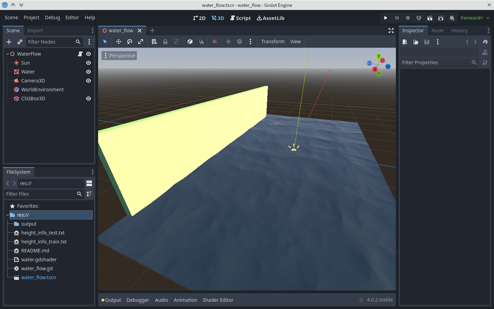
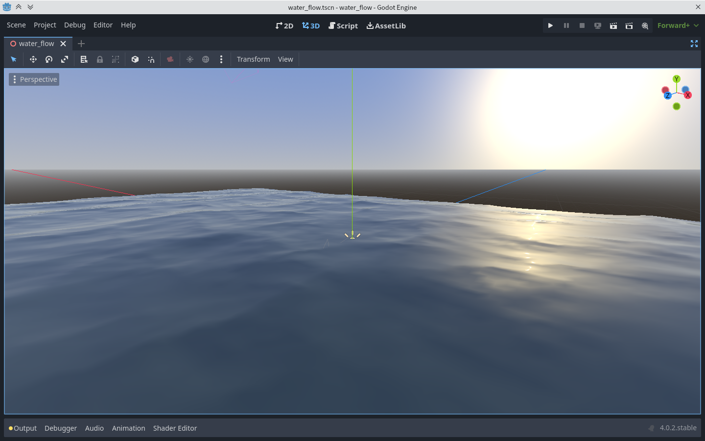
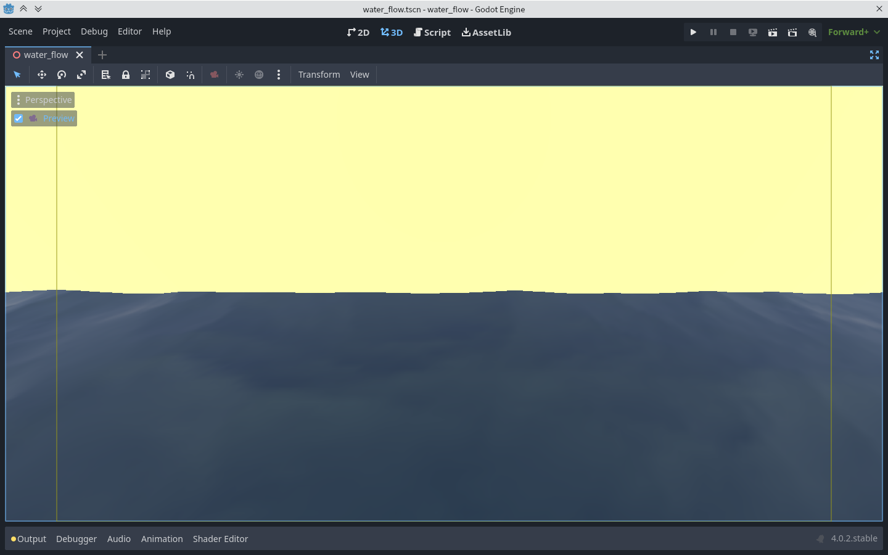

# 基于godot的虚拟水体搭建

本项目为使用 godot 引擎与计算机图形学基础实现的模拟河流环境，主要用来给另一项目[使用深度神经网络对虚拟水体进行水位预测](https://github.com/ShaoMengou/cnn_height_predict)生成测试数据。

本项目内含以下内容：

1. 相对写实的海平面 shader
2. godot4 内容录制功能使用范例
3. godot4 文件读写功能使用范例
4. 波光粼粼的海平面，让人心旷神怡

在 godot 中运行本项目（双击project.godot)时，可以看到背景墙前的海水随时间有规律的上涨下落。文件系统会不停地将当前图像帧写入一个视频文件，水位文件则写入相应纯本文文件中。

